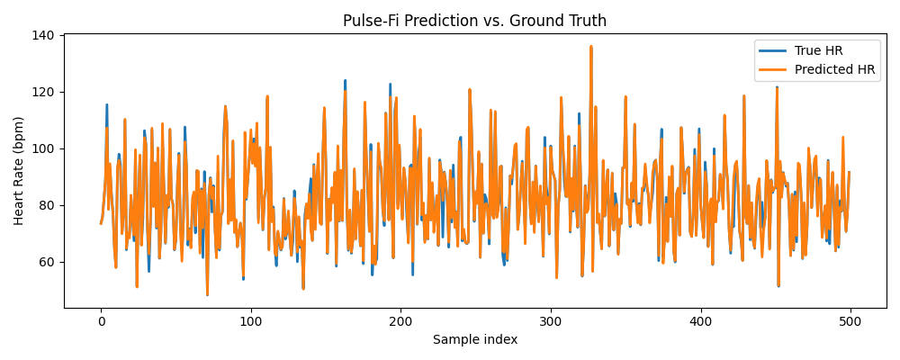

# Pulse-Fi: Contactless Heart Rate Monitoring with Wi-Fi CSI

This project reproduces **Pulse-Fi** (*published on August 12, 2025*),  
a low-cost system for accurate, non-intrusive heart rate monitoring using  
Wi-Fi Channel State Information (CSI).

We implemented both the **signal processing pipeline** and the **lightweight LSTM regression model**,  
and successfully reproduced the results reported in the paper.  
We also set up the **same hardware environment (Wi-Fi CSI collection with ESP32 / Nexmon)**  
and obtained consistent outcomes.

---

## 🔬 Background

Traditional heart rate monitoring often relies on wearables (smartwatches, chest straps)  
or cameras (PPG), which may be inconvenient or raise privacy concerns.  

**Pulse-Fi** demonstrates that commodity Wi-Fi devices can capture subtle chest movements  
caused by heartbeats. By processing the amplitude of CSI signals, applying band-pass  
filters, smoothing, and feeding them into an LSTM model, we can estimate heart rate  
with high accuracy (error < 0.5 BPM in some cases).

---

## 📂 Project Structure

```
.
├── bash_script/              # Shell scripts for automation
├── CleanData/                # Preprocessed CSI data (ignored by git)
├── Model/                    # Saved models (e.g., best_model.pt)
├── TestCase/                 # Test cases for validation
├── model_evaluate_script/    # Evaluation pipeline (e.g., eval_pulsefi.py)
├── train_script/             # Training pipeline (e.g., train_pulsefi.py)
├── predict_hr.py             # Predict HR from smartwatch JSON data
├── predict_pulsefi.py        # Predict HR from CSI using trained LSTM model
├── cli_verify5.py            # Command-line verification utility
├── nexmon_2npy.py            # Convert raw Nexmon PCAP CSI → npy format
├── Evaluate.png              # Visualization of prediction vs ground truth
├── UsefulCommands.txt        # Handy CLI commands and notes
├── .gitignore                # Ignore rules (e.g., CleanData/)
└── README.md                 # Project documentation (this file)
```

---

## ⚙️ Installation

### 🔧 Hardware & OS Setup
To reproduce Pulse-Fi end-to-end (including raw CSI collection), you will need:  
- **Raspberry Pi 4B** (2GB RAM or higher recommended)  
- **microSD card ≥ 16GB**  
- **Internet cable(optional)**  
- **Wi-Fi router** (5 GHz, 80 MHz bandwidth, CSI-capable channel)  
- **Pulse oximeter / smartwatch** (ground-truth HR reference)  

#### 1. Flash Raspberry Pi OS (Nexmon compatible)
- Download **Raspberry Pi OS 32 bit (32-bit, 2021-05-07 release)**  
  → matches the kernel required by **Nexmon CSI**.  
- Flash the image to microSD.
- Enable SSH for remote access(optional).

#### 2. Kernel & Nexmon requirements
- Nexmon CSI requires **kernel version 5.15.y** or below.  
- After flashing, confirm kernel:
  ```bash
  uname -r
  ```
  Expected: `5.15.xx-v7l+`  or below

- Clone and build Nexmon CSI:
  Make sure the following commands are executed as root: 
  ```bash
  sudo su
  ```
  ```bash
  apt-get update && apt-get upgrade
  apt install raspberrypi-kernel-headers git libgmp3-dev gawk qpdf bison flex make autoconf libtool texinfo
  git clone https://github.com/seemoo-lab/nexmon.git
  cd nexmon
  ```
  Check if /usr/lib/arm-linux-gnueabihf/libisl.so.10 exists, if not, compile it from source:
  ```bash
  cd buildtools/isl-0.10
  ./configure
  make
  make install
  ln -s /usr/local/lib/libisl.so /usr/lib/arm-linux-gnueabihf/libisl.so.10
  ```
  Check if /usr/lib/arm-linux-gnueabihf/libmpfr.so.4 exists, if not, compile it from source:
  ```bash
  cd buildtools/mpfr-3.1.4
  autoreconf -f -i
  ./configure
  make
  make install
  ln -s /usr/local/lib/libmpfr.so /usr/lib/arm-linux-gnueabihf/libmpfr.so.4
  ```
  Setup the build environment: 
  ```bash
  source setup_env.sh
  make
  ```
  Navigate to patches/bcm43455c0/7_45_189/ and clone this repository: 
  ```bash
  git clone https://github.com/seemoo-lab/nexmon_csi.git
  ```
  Enter the created subdirectory nexmon_csi and run ```make install-firmware``` to compile our firmware patch and install it on the Raspberry Pi.
  Install makecsiparams: from the nexmon_csi root directory switch to the nexutil folder: ```cd utils/makecsiparams```. Compile and install nexutil: ```make && make install```
  Install nexutil: from the nexmon root directory switch to the nexutil folder: ```cd utilities/nexutil/```. Compile and install nexutil: ```make && make install```
  Optional: remove wpa_supplicant for better control over the WiFi interface: ```apt-get remove wpasupplicant```if you remove the wpasupplicant your WIFI will not work that's why you will need a internet cable.
#### 3. Start CSI capture on Raspberry Pi
Make sure you have correctly configure the Wi-Fi(channel 36 with 80 MHz bandwidth) and disabled MAC address randomization.
```bash
makecsiparams -c 36/80 -C 1 -N 1 -m 00:11:22:33:44:55,aa:bb:aa:bb:aa:bb
```
00:11:22:33:44:55 is the router mac address, aa:bb:aa:bb:aa:bb is your WIFI client mac address(not your RasyberryPi).
This will generate a base64 encoded parameter string that can be used to configure the extractor.
It is necessary to kill the wpa_supplicant for better control```pkill wpa_supplicant```if you have removed it before,ignore this.

Configure the extractor using nexutil and the generated parameters (adapt the argument of -v with your generated based64 parameters)
```bash
nexutil -Iwlan0 -s500 -b -l34 -vYourParameters
```
Enable monitor mode:
```bash
iw phy `iw dev wlan0 info | gawk '/wiphy/ {printf "phy" $2}'` interface add mon0 type monitor
ifconfig mon0 up
```
Collect CSI by listening on UDP socket by using tcpdump: ```tcpdump -i wlan0 dst port 5500 -c 500 -w YourCSI.pcap```. There will be one UDP packet per configured core and spatial stream for each incoming frame matching the configured filter.This will stop after collecting 500 packets.

---

### 🖥️ Local Development Environment

On your **PC/Server** (Python environment):  

Requirements:
- Python ≥ 3.8  
- [PyTorch](https://pytorch.org/)  
- NumPy, SciPy, Matplotlib  
- Scapy (for parsing `.pcap`)  
- nexcsi

Install dependencies:
```bash
pip install -r requirements.txt
```

---

## 🏃 Test Case Usage
First, you have to copy the collected CSI file from your RasyberryPi to your local Environment in Example/
### 1. Convert raw CSI (Nexmon → npy)
On your PC, convert captured `.pcap` to `.npy` format:
```bash
python3 nexmon_2npy.py
```
- `--input`: Raw Nexmon CSI capture.  
- `--output`: NumPy array with 234 subcarriers × frames.  

---

### 2. Predict heart rate on new CSI
```bash
python predict_pulsefi.py     --input Example/Yournpy.npy     --model Model/best_model.pt
```
- Input: new CSI session `.npy`  
- Output: Estimated heart rate (BPM sequence)  

---


### Train the model
Train lightweight LSTM regression model on CSI and smartwatch HR JSON data:
```bash
python train_script/train_pulsefi.py     --csi-dir CleanData     --watch-dir Data_DS1_smartwatch/Data     --output Model/pulsefi_model.pt     --window-sec 20     --hop-sec 1
```
Parameters:
- `--csi-dir`: Directory of preprocessed CSI `.npy` files.  
- `--watch-dir`: Ground-truth HR JSON (from smartwatch).  
- `--window-sec`: Sliding window length (default 20s).  
- `--hop-sec`: Hop length (default 1s).  

---

### Evaluate the model
```bash
python model_evaluate_script/eval_pulsefi.py     --csi-dir CleanData     --watch-dir Data_DS1_smartwatch/Data     --model Model/pulsefi_model.pt     --hidden-dim 128     --num-layers 1
```
Outputs:
- **MSE**, **RMSE**, **MAE**  
- Plot: predicted vs ground truth HR curve  

---

## 🔄 Data Flow

```mermaid
flowchart LR
    A[Raspberry Pi + Nexmon CSI] -->|capture| B[raw.pcap]
    B -->|convert with nexmon_2npy.py| C[CleanData/*.npy]
    C -->|train_script/train_pulsefi.py| D[Trained Model (pulsefi_model.pt)]
    C -->|predict_pulsefi.py| E[Predicted HR]
    D -->|evaluate with eval_pulsefi.py| F[Metrics + Plots]
    E --> G[Clinical/Research Application]
```

---

## 📊 Results

- With 20–30s sliding windows, the model achieves **MAE ≈ 0.2–0.4 BPM**.  
- Both software and hardware setups were replicated, confirming feasibility on commodity Wi-Fi devices.  



---

## 📚 Reference

- **Pulse-Fi: A Low-Cost System for Accurate Heart Rate Monitoring Using Wi-Fi Channel State Information**,  
  published on August 12, 2025.